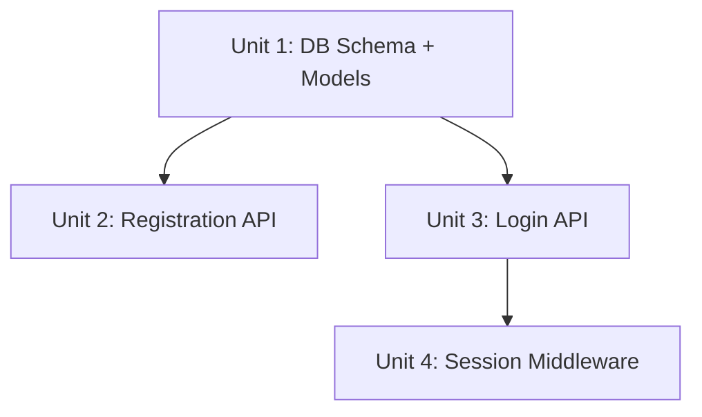

# AI-DLC Phase 2: Plan (规划)

Design the solution and decompose work into tracked, dependency-ordered units.

## Goal

Translate approved specifications into a concrete technical plan that can be executed unit by unit.

## Flow

```
Approved Spec + BDD Features
  │
  ▼
SDD: Design Doc (architecture, data model, API, state machine)
  │
  ▼
SDD: Task Decomposition (units with DAG)
  │
  ▼
TDD: Test Plan (per scenario, written before implementation)
  │
  ▼
Gate: Human review → approved or revise
```

## SDD — Design Document

### Architecture

```markdown
## Architecture

- Frontend: SPA with React + TypeScript
- Backend: Python serverless functions on TCB/Aliyun FC
- Database: TCB DocDB / Aliyun TableStore
- Auth: JWT-based, stateless
```

### Data Model

| Field | Type | Constraints |
|-------|------|-------------|
| id | UUID | PK |
| email | string | UNIQUE, NOT NULL |
| password_hash | string | NOT NULL |

### API Contract

| Method | Path | Request | Response |
|--------|------|---------|----------|
| POST | /auth/login | `{email, password}` | `{token, expires_in}` |

### State Machine

```
ANONYMOUS → LOGGED_IN → SESSION_EXPIRED
              ↓
          LOGGED_OUT
```

## SDD — Task Decomposition with DAG



```yaml
units:
  - id: unit-1
    name: Database schema and user model
    depends_on: []
    scenarios: []
  - id: unit-2
    name: Registration endpoint
    depends_on: [unit-1]
    scenarios: ["FR-001 @positive", "FR-001 @negative"]
  - id: unit-3
    name: Login endpoint
    depends_on: [unit-1]
    scenarios: ["FR-002 @positive", "FR-002 @negative", "FR-002 @edge"]
```

## TDD — Test Plan

For each scenario, plan the test cases **before** writing implementation.

```markdown
## FR-001 @positive: Successful login

Test cases:
  1. test_login_valid_credentials → expect JWT token
  2. test_login_returns_user_data → expect user object
  3. test_login_sets_expiry → expect expires_in = 3600
```

## Artifacts

| Artifact | Location | Purpose |
|----------|----------|---------|
| Design doc | `openspec/changes/{id}/design.md` | Architecture + data model |
| Task list | `openspec/changes/{id}/task-list.md` | DAG + unit breakdown |
| Test plan | Embedded in task-list or separate | Per-scenario test cases |

## Gate

**Before advancing to Verify phase:**
- [ ] Design doc completed (architecture, data model, API, state machine)
- [ ] Tasks decomposed with explicit dependency DAG
- [ ] Test plans written per scenario
- [ ] Human reviewed and approved
