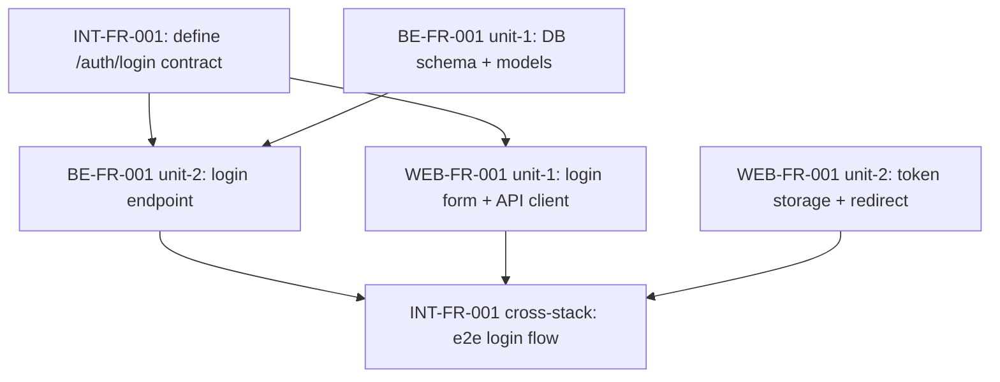

# AI-DLC Phase 2: Plan (规划)

Design the solution and decompose work into tracked, dependency-ordered units, including cross-component edges.

## Goal

Translate approved specifications into a concrete technical plan that can be executed unit by unit, with explicit cross-component dependencies and contract references.

## Flow

```
Approved Spec + BDD Features (per-component + cross-stack)
  │
  ▼
SDD: Design Doc
  - architecture (per component)
  - data model
  - API contract (references INT-FR-*)
  - state machine
  - integration section (cross-component flow)
  │
  ▼
SDD: Task Decomposition (units with DAG, including cross-component edges)
  │
  ▼
TDD: Test Plan (per scenario, written before implementation)
  - unit / integration / e2e / cross-stack layer
  │
  ▼
INT: Contract plan (which contracts change, version impact)
  │
  ▼
Gate: Human review → approved or revise
```

## SDD — Design Document (multi-component aware)

A multi-component design doc is organized by **component sections** plus an **integration section**.

```markdown
## Design — CHG-{{id}}

**Affects:** [{{components}}]
**Contracts touched:** {{list or "none"}}

### Component: backend (BE-FR-*)
- Architecture: {{serverless / container / ...}}
- Data model: {{tables / collections}}
- API surface: {{references INT-FR-* contract}}
- State machine: {{...}}

### Component: web (WEB-FR-*)
- Architecture: {{SPA / SSR}}
- Routes: {{...}}
- Data flow: {{uses aidlc/packages/shared generated from INT-FR-001}}

### Component: native (NATIVE-FR-*)
- Architecture: {{native architecture}}
- Data flow: {{uses aidlc/packages/shared generated from INT-FR-*}}

### Component: desktop (DESKTOP-FR-*)
- Architecture: {{desktop architecture}}
- Data flow: {{uses aidlc/packages/shared generated from INT-FR-*}}

### Component: wxa (WXA-FR-*)
- Architecture: {{WeChat Mini Program}}
- Data flow: {{uses aidlc/packages/shared generated from INT-FR-*}}

### Component: mya (MYA-FR-*)
- Architecture: {{Mini Program}}
- Data flow: {{uses aidlc/packages/shared generated from INT-FR-*}}

### Component: tta (TTA-FR-*)
- Architecture: {{TikTok Mini Program}}
- Data flow: {{uses aidlc/packages/shared generated from INT-FR-*}}

### Integration
- Flow: {{web → backend → DB; or app → backend → event → ...}}
- Contract refs: INT-FR-001, INT-FR-002
- Failure modes: {{timeout, retry, fallback}}
- Backward compat: {{additive / breaking → migration}}
```

### Data Model

| Field | Type | Constraints |
|-------|------|-------------|
| id | UUID | PK |
| email | string | UNIQUE, NOT NULL |
| password_hash | string | NOT NULL |

### API Contract

| Method | Path | INT FR | Provider | Consumer |
|--------|------|--------|----------|----------|
| POST | /auth/login | INT-FR-001 | BE-FR-001 | WEB-FR-001, NATIVE-FR-001, DESKTOP-FR-001, WXA-FR-001, MYA-FR-001, TTA-FR-001 |

### State Machine

```
ANONYMOUS → LOGGED_IN → SESSION_EXPIRED
              ↓
          LOGGED_OUT
```

## SDD — Task Decomposition with DAG (multi-component)

Tasks MUST include cross-component edges. A task that produces or consumes a contract depends on the corresponding `INT-FR-*` task.



```yaml
units:
  - id: int-contract-1
    fr: INT-FR-001
    affects: [contracts]
    depends_on: []
    deliverables: [aidlc/contracts/api/auth.yaml]
  - id: be-unit-1
    fr: BE-FR-001
    affects: [backend]
    depends_on: []
    scenarios: []
  - id: be-unit-2
    fr: BE-FR-001
    affects: [backend]
    depends_on: [int-contract-1, be-unit-1]
    scenarios: ["BE-FR-001 @positive", "BE-FR-001 @negative"]
  - id: web-unit-1
    fr: WEB-FR-001
    affects: [web]
    depends_on: [int-contract-1]
    scenarios: ["WEB-FR-001 @positive", "WEB-FR-001 @negative"]
  - id: cross-stack-1
    fr: INT-FR-001
    affects: [web, backend]
    depends_on: [be-unit-2, web-unit-1]
    layer: cross-stack
    scenarios: ["INT-FR-001 @positive", "INT-FR-001 @negative", "INT-FR-001 @edge"]
```

## TDD — Test Plan (per scenario, per layer)

Each scenario gets a test plan that names the **layer** it runs at.

```markdown
## BE-FR-001 @positive: Login API success
Layer: integration
Test cases:
  1. test_login_valid_credentials_returns_jwt
  2. test_login_sets_expiry_3600

## WEB-FR-001 @positive: Login form happy path
Layer: e2e
Test cases:
  1. test_login_form_submits_and_redirects

## INT-FR-001 @positive: Full web→backend login flow
Layer: cross-stack
Test cases:
  1. test_web_login_e2e_against_preview_url
```

## INT — Contract Plan

For each contract change, list:
- Old version, new version
- Breaking? (yes / no) → if yes, plan migration in `aidlc/contracts/CHANGELOG.md`
- Consumers affected (which components will pull the new shared types)
- Backward-compat strategy (additive vs. deprecate-then-remove)

## Artifacts

| Artifact | Location | Purpose |
|----------|----------|---------|
| Design doc | `aidlc/openspec/changes/{id}/design.md` | Per-component + integration |
| Task list | `aidlc/openspec/changes/{id}/task-list.md` | DAG with cross-component edges |
| Test plan | Embedded in task-list or separate | Per-scenario, per-layer |
| Contract plan | `aidlc/openspec/changes/{id}/contract-diff.md` placeholder | Filled in Verify |

## Gate

**Before advancing to Verify phase:**
- [ ] Design doc has per-component sections + integration section
- [ ] Tasks decomposed with explicit dependency DAG (including cross-component edges)
- [ ] `INT-FR-*` tasks precede the consuming per-component tasks
- [ ] Test plans name the layer (`unit` / `integration` / `e2e` / `cross-stack`) per scenario
- [ ] Contract plan identifies breaking vs. additive
- [ ] Human reviewed and approved
